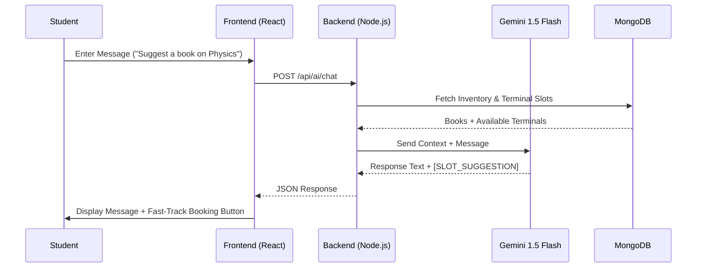
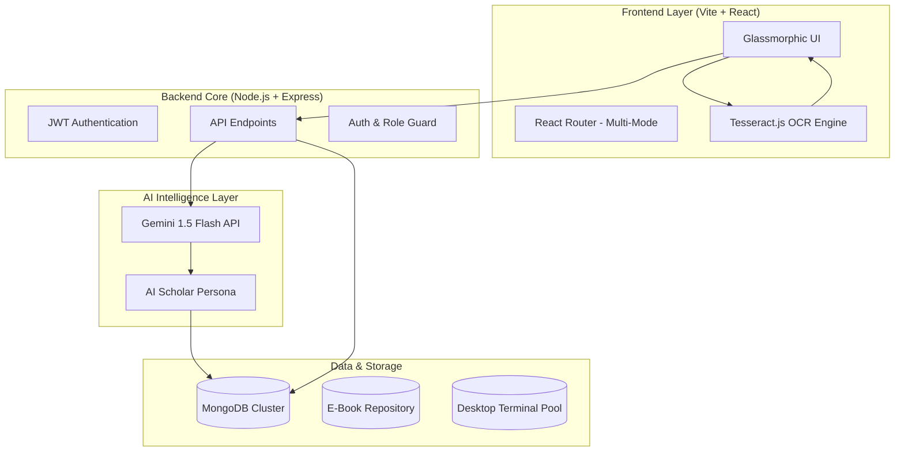

# 🌌 ASTU Libris: The Digital AI Nexus

<div align="center">


**A Next-Generation AI-Integrated Library Ecosystem**  
*Empowering Researchers with Neural Book Discovery and Smart Resource Pooling.*

[Features](#-core-capabilities) • [Architecture](#-system-architecture) • [Use Cases](#-strategic-use-cases) • [Tech Stack](#-technical-blueprint) • [3D Aesthetic](#-visual-language)

</div>

---

## 📖 The Vision

**ASTU Libris** is not just a digital library; it is a **dynamic knowledge grid**. Designed for high-performance academic environments, it merges traditional resource management with cutting-edge **Generative AI** and **Smart Study Pooling**. 

Whether you are a student seeking the perfect research paper through the **AI Scholar**, or a Librarian managing a multi-node network across departments, ASTU Libris provides a seamless, glassmorphic interface that feels as advanced as the content it hosts.

---

## 💠 Core Capabilities

### 🧠 ASTU AI Scholar
Powered by **Gemini 1.5 Flash**, the AI Scholar is your personal research companion. It doesn't just chat; it understands the entire library inventory.
- **Neural Discovery**: Recommends books based on complex research queries.
- **Smart Scheduling**: Detects terminal availability and suggests optimal study slots.
- **Structured Interaction**: Seamlessly integrates with the booking system via auto-generated slot suggestions.

### 📑 Smart E-Book Engine
- **OCR-Integrated Search**: Uses **Tesseract.js** to index and search content within documents.
- **Real-time Analytics**: Visualizes reading trends and popular categories using **Recharts**.
- **Cross-Node Sync**: Syncs your progress and bookmarks across different library nodes.

### 🏢 Multi-Node Governance
- **Global Admin Control**: Manage all library locations, announcements, and global user permissions.
- **Localized Librarians**: Node-specific management of inventory, terminal pools, and chat support.

## 📊 Use Case & Logic Flow

### Use Case Diagram
The following diagram highlights the core interactions within the ASTU Libris ecosystem:

```mermaid
useCaseDiagram
    actor "Student" as S
    actor "Librarian/Admin" as L
    actor "General Admin" as GA
    actor "AI Scholar" as AI

    package "Digital Library Nexus" {
        usecase "Neural Book Search" as UC1
        usecase "AI Chat & Research" as UC2
        usecase "Reserve Smart Terminal" as UC3
        usecase "Manage Library Node" as UC4
        usecase "System Configuration" as UC5
        usecase "OCR Document Parsing" as UC6
    }

    S --> UC1
    S --> UC2
    S --> UC3
    S --> UC6
    
    L --> UC4
    L --> UC1
    
    GA --> UC5
    GA --> UC4

    AI ..> UC2 : Powers
    AI ..> UC3 : Suggests Slots
```

### Sequence Diagram: AI Scholar Chat Flow
This is the high-concurrency flow for a typical AI research session:



---

## ⚡ 3D Neural Movement

ASTU Libris features a signature **3D Neural Movement** that brings the interface to life. This is achieved through a combination of CSS 3D transforms and hardware-accelerated animations.

### Implementation Snippet: 3D Floating Book
The "3D Float" effect creates a parallax-like depth in the digital library grid:

```css
/* Core 3D Movement Engine */
.astu-3d-nexus {
  transform-style: preserve-3d;
  perspective: 1000px;
}

.astu-float-3d {
  animation: float3D 8s ease-in-out infinite;
  transition: transform 0.5s cubic-bezier(0.4, 0, 0.2, 1);
}

@keyframes float3D {
  0%, 100% { 
    transform: translateY(0) rotateX(0deg) rotateY(0deg); 
  }
  25% { 
    transform: translateY(-15px) rotateX(5deg) rotateY(2deg); 
  }
  50% { 
    transform: translateY(-5px) rotateX(-2deg) rotateY(-5deg); 
  }
  75% { 
    transform: translateY(-12px) rotateX(3deg) rotateY(4deg); 
  }
}

.astu-float-3d:hover {
  transform: translateZ(50px) scale(1.05);
  box-shadow: 0 30px 60px rgba(99, 102, 241, 0.3);
}
```

---

## 🏗 System Architecture

The following diagram illustrates the high-level interaction between the ecosystem components:



---

## 🚀 Strategic Use Cases

### 1. The Autonomous Researcher
A student asks the AI Scholar for a book on "Quantum Mechanics". The AI not only lists the books but also detects that a high-performance terminal in the "Tech Node" is free in 10 minutes and provides a one-click reservation link.

### 2. Multi-Department Governance
A University General Admin creates a new "Medical Library Node" and assigns a Librarian. The Librarian immediately seeds the node with specialized journals and sets up a desktop pool for medical students.

### 3. OCR Data Extraction
A student uploads a scanned research paper. The system uses built-in OCR to extract text, allowing the AI Scholar to summarize the content and suggest related books from the global inventory.

---

## 🛠 Technical Blueprint

### 🎨 Frontend: "Midnight Glass" Design System
- **Framework**: Vite + React 19
- **Styling**: Tailwind CSS 4.0 + Custom Glassmorphism Engine
- **Animations**: Framer-Motion (suggested) / CSS Keyframe Reveal
- **Charts**: Recharts for study analytics
- **Client-side OCR**: Tesseract.js

### ⚙️ Backend: "Nexus" API
- **Runtime**: Node.js + Express
- **Database**: MongoDB (Mongoose ODM)
- **AI Integration**: `@google/generative-ai`
- **Security**: JWT with Multi-Level RBAC (General Admin, Admin, Librarian, Student)

---

## ✨ 3D Aesthetic & Movement

ASTU Libris uses a **Premium Cyberpunk Design Language** characterized by:

1.  **3D Floating States**: Elements use the `astu-float` class for subtle vertical oscillation, simulating a zero-gravity UI.
2.  **Crystal Glassmorphism**: High-saturation background blurs (`backdrop-blur-24px`) paired with primary glow accents.
3.  **Holographic Gradients**: Dynamic linear gradients that shift as users navigate between light and dark modes.
4.  **Neural Reveal**: Content animates in using the `astu-anim-in` reveal engine, utilizing cubic-bezier curves for a "smart" feel.

> [!TIP]
> **To experience the movement**: Launch the dev server and hover over any library node or book card. The UI responds with scale-transformations and glow-intensification.

---

## 🛠 Installation & Setup

1.  **Clone the Nexus**:
    ```bash
    git clone https://github.com/Wakjira-Tesama/Digital-Library-.git
    ```
2.  **Backend Ignition**:
    ```bash
    cd backend
    npm install
    # Create .env with MONGO_URI, JWT_SECRET, and GEMINI_API_KEY
    npm run dev
    ```
3.  **Frontend Uplink**:
    ```bash
    cd frontend
    npm install
    npm run dev:student # For Student Portal
    npm run dev:admin   # For Admin Dashboard
    ```

---

<div align="center">
  <p>Built with ❤️ by the ASTU Digital Team</p>
  <sub>© 2026 ASTU Libris Ecosystem. All rights reserved.</sub>
</div>
